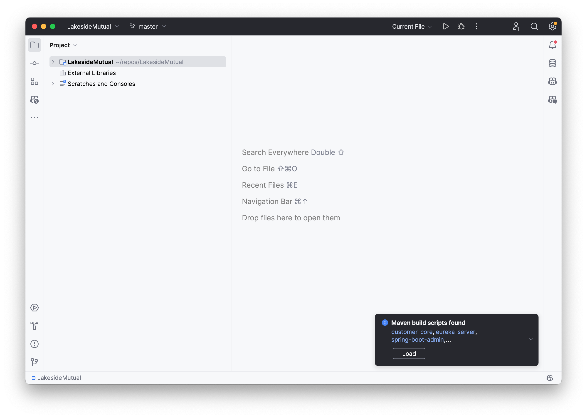

# IDE Instructions

## Import Maven Project into IDE
Note: We assume you already cloned the corresponding application and have the source code on your local file system. We further assume that you installed Java and Maven on your system.

### IntelliJ IDEA
In IDEA you can import an existing Maven project with `File -> Open...`. A dialog opens on which you can choose the directory of your project (for example `~/source/LakesideMutual` to import all projects at once).

A pop-up opens to inform you about "Maven build scripts found" that you can then import by clicking _load_:

### Visual Studio (VS) Code
Preconditions: in VS Code you will need a few extensions for Java development. We recommend to install the [Java Extension Pack](https://marketplace.visualstudio.com/items?itemName=vscjava.vscode-java-pack) which also includes support for Maven.

Use `File -> Open Folder...` to open the folder of the corresponding project in VS Code. 

VS Code asks you if you want to import the Java project; say _yes_ or _always_:

After opening the folder and enabling the Java project you should be ready to work on the application. With the Maven panel (on the left side at the bottom of the explorer) you can also run Maven goals, such as `spring-boot:start`:

### Eclipse / Spring Tool Suite (STS)
In case you use Eclipse, ensure that you use _Eclipse IDE for Java Developers_, _Eclipse IDE for Enterprise Java Developers_, or _Spring Tools 4 for Eclipse (STS)_. Those versions of Eclipse include required plugins such as the Maven plugin.

You can import a Maven project via `File -> Import...` and then choose `Maven -> Existing Maven Projects`. 

Set the directory of the project as root path and press `Finish`:

## Import Node App into IDE
Our frontend applications (or the risk management server in LakesideMutual) typically use Node.js. For these apps, we recommend to use Visual Studio Code.

### VS Code
Use `File -> Open Folder...` to open the folder of the corresponding project in VS Code.

### IntelliJ IDEA
In IDEA you can import an existing Node.js project with `File -> New -> Project From Existing Sources...`:

Choose the directory of the Node project you want to import:

Choose to create a _new project_:

After that, press two times _Next_ and then _Finish_.

Your node project is imported and ready to run. With a right-click to the `package.json` file you can show npm scripts or run `npm install` directly:

If you click _Show npm Scripts_, you can also start the application easily:

### Eclipse
There might be plugins around to develop Node.js applications in Eclipse, but we do not really recommend this path.
